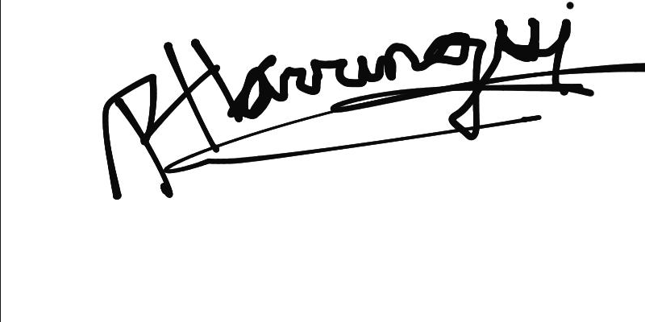
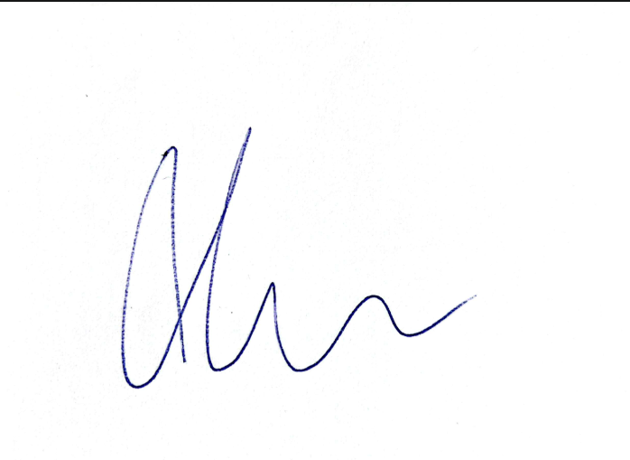

# Código de conducta de nuestro equipo

## 1. Propósito

Este documento define cómo cada equipo va a colaborar, comunicarse, resolver problemas y apoyarse durante el desarrollo del proyecto del curso **IIC2513 Tecnologías y Aplicaciones Web**. Su objetivo es que cada equipo converse y piense en situaciones que podrían llegar a ocurrir durante el semestre y que puedan abordarlas desde el respeto, la responsabilidad y la comprensión.

## 2. Alcance

Aplica a todas las actividades relacionadas con el desarrollo del proyecto del curso, tales como:
- Reuniones de planificación, diseño e implementación
- Desarrollo y revisión de código
- Escritura de documentación e implementación de las entregas
- Interacción con el equipo docente, otros grupos del curso y entre estudiantes del equipo

## 3. Normas de Comunicación

### Canal de comunicación principal
> Nuestros principales canales de comunicación serán Whatsapp para la comunicación inmediata y Google Meets o Discord para reuniones periódicas donde iremos revisando los avances generales del proyecto.

### Reuniones de equipo 
> La frecuencia con las que nos reuniremos será de mínimo 1 vez por semana, de esta forma nos aseguraremos de que haya una cota mínima de comunicación para ver el estado actual del proyecto y discutir los avances posteriores, esto será por medio de Google Meets o Discord como sea de preferencia para el grupo. Para las reuniones con el ayudante, consideramos necesario una reunión previa a la entrega, idealmente de 1 a 3 días hábiles antes del plazo de entrega y la reunión post entrega para el feedback del ayudante.

### Cuándo trabajar en el proyecto
> Nuestra metodología para trabajar será por medio de metas propuestas de manera semanal, de tal forma que logremos segmentar cada entrega en una carga baja pero constante, a elección de cada integrante sobre cuando trabajar durante la semana pero cumpliendo la meta propuesto a comienzo de esta.

## 4. ¿Qué Haremos Cuando...?

### 4.1 Enfermedad o emergencia de salud
> En caso de que uno de los miembros se enferme o no pueda trabajar en el proyecto del curso por razones de salud.

1. Si **YO** me enfermo, avisaré a mi equipo lo antes posible  
2. **Yo** indicaré el tiempo estimado de ausencia  
3. **Mi equipo** va a redistribuirse mis tareas temporalmente
4. **Como equipo** avisaremos al ayudante del grupo para su consideración
5. Si existe certificado médico, **YO** informaré al ayudante de bienestar y gestionar ante la DiPre
6. Posterior a la situación de emergencia, conversaremos como grupo para reasignar una tarea futura, de tal forma que el integrante que solicitó este periodo de emergencia, pueda compensar las labores omitidas.

### 4.2 Carga académica excesiva / Tope de evaluaciones

1. Si **YO** tengo una entrega de otro curso un día de entrega de este proyecto, comunicaré previamente con mi grupo (idealmentente mínimo 3 días hábiles antes de la entrega) de tal forma que el resto del equipo se pueda organizar oportunamente.

### 4.3 Indisponibilidad prevista (viajes, vacaciones)
> En ocasiones, algún estudiante podría tener un viaje o evento previsto que le impida trabajar en el proyecto en algún momento del semestre. Conversen sobre eso: ¿tengo algo planificado que pueda impedir que trabaje algún o algunos días? En otras ocasiones hemos visto: viajes para asistir a matrimonios o competencias deportivas, participación en eventos de larga duración, o incluso por razones religiosas. Si no tienen esta indisponibilidad, pueden colocar eso: "Ninguno de los miembros de este equipo reportó tener alguna indisponibilidad prevista"

1. Si **YO** tengo un viaje planificado durante lo que queda de semestre, este deberá ser avisado con una mayor anticipación que el punto anterior en la medida que sea posible (5 días hábiles como mínimo)

### 4.4 Emergencia personal no planificada
> Es difícil resumir todas las situaciones que podrían ocurrir a nivel personal y que impiden que podamos continuar con nuestras responsabilidades académicas: hay cosas más importantes que una evaluación en la universidad. Traten de pensar en situaciones generales: ¿qué me gustaría que ocurriera si realmente no puedo contribuir a mi equipo por alguna razón fuera de mi alcance? (Podría servirles colocar ejemplo)

1. Si **YO** no puedo trabajar porque me pasó algo, como parte del protocolo que el grupo realizó, se establecerá que para estas situaciones se informará de la emergencia cuanto antes, para posteriormente levantar una reunión extraordinaria con el equipo y determinar las acciones posteriores a esta emergencia.

### 4.5 Retraso en entrega / Inclumplimiento de plazo
> Sabemos que tienen la capacidad de desarrollar el proyecto de buena manera y obtener la mayor nota posible (sería injusto darles un proyecto que no esperamos que puedan completar), pero si por algún motivo no pudieran entregar todo a tiempo, ¿qué planean hacer?

1. Si **como equipo** no tenemos el entregable listo para el día de la entrega, buscaremos realizar una entrega parcial de todas maneras, pero buscando cumplir la mayor cantidad de objetivos planteados para dicha entrega. Paralelamente, esta situación será comentada al ayudante guía en la medida que detectemos que haremos esta entrega parcial, para discutir alguna alternativa con tal de amortizar la penalización de nota.

2. Además de esto, será un tema que abordaremos como equipo para reflexionar acerca de la carga asignada a cada integrante y sus habilidades individuales para su mayor aprovechamiento en torno al proyecto.

### 4.6 Persona no ubicable o contactable (no responde)

1. Si **como equipo** no conseguimos respuesta de un miembro para asignar responsabilidades o confirmar que está progresando, esto será informado inmediatamente al ayudante guía para registrar la situación, confirmando este hecho por todos los integrantes afectados.

2. Si esta situación se llegara a ser reiterada y tampoco notificada por parte de la persona ausentada, se buscará conversar con el equipo docente para que se discuta hacerca de la permanencia o no del integrante en el grupo.

### 4.7 Diferencias de opinión

1. Si **como equipo** no logramos llegar a un acuerdo sobre una decisión de diseño del proyecto, nos veremos en la posibilidad de plantearlo al ayudante guía para recibir una opinión externa y en base a esta dinámica, decidir mediante una mayoría simple la decisión a implementar sin dejar atrás del todo al resto de opiniones planteadas para evitar descartar el esfuerzo realizado por todos los integrantes.

### 4.8 Riesgo de no completar el proyecto
> La última entrega del proyecto del curso es reprobatoria. Planifíquense con esto en mente. Sin embargo, a veces existen situaciones que nos impiden cumplir con nuestras planificaciones (algunas ya mencionadas, otras no planificadas, a veces el proyecto es muy ambicioso, etc.). Si en algún punto creen que no alcanzan a completar la última entrega del proyecto dentro del plazo establecido, ¿qué piensan hacer?

1. Si **como equipo** creemos que podríamos no llegar con el proyecto listo a la última entrega, como primera acción, se notificará al ayudante guía y al cuerpo docente, entregando las respectivas razones del porqué, de tal forma que evalúe la situación desde todas las aristas y se pueda llegar a un acuerdo parcial para cumplir con la entrega final.

### 4.9 Manteniendo la integridad académica
> Ya en la primera clase del curso hablamos de integridad académica (incluyendo cómo citar y cómo referenciar el uso de IA). ¿Cómo piensan mantener la integridad académica? Conversen sobre cómo piensan citar y referenciar el uso de código de fuentes externas, sobre cómo piensan utilizar IA durante el semestre y... respondan en su checklist lo más difícil: ¿qué harían si identifican código externo o de una IA que no ha sido referenciado por otro miembro de su equipo?

1. Si **YO** encuentro código que aparentemente fue desarrollado por una IA pero no se referenció, nos acercaremos directamente a la persona responsable por no referenciar el uso de IA de manera explícita, con tal de que si la referencie y no se atribuya como trabajo propio. Si esta situación llegase a ser reiterada por parte de un mismo integrante, será notificado al ayudante guía.

## 4. Firma de cada integrante del grupo

### Integrante 1: Álvaro Panozo

### Integrante 2: Juan Andrés Muñoz

### Integrante 3: Rodrigo Harrison

### Integrante 4: Alonso Carrión

