# E0 :construction:

* :pencil2: **Nombre Grupo:** Los 404

## Descripción general :thought_balloon:

- ¿De qué se tratará el proyecto?
Dawdle 404 será una aplicación web diseñada para ayudar a estudiantes universitarios a planificar, organizar y priorizar sus tareas, clases, metas y eventos. Su objetivo es transformar la procrastinación en productividad mediante un entorno visual limpio e intuitivo que permita gestionar el tiempo de manera efectiva, con recordatorios, metas y seguimiento de progreso.

- ¿Cuál es el fin o la utilidad del proyecto?
El fin del proyecto es ofrecer una herramienta digital que optimice la gestión del tiempo y reduzca el estrés académico. Dawdle 404 busca convertir la desorganización y postergación en hábitos productivos, ayudando a los usuarios a mantener el control de sus actividades, mejorar su rendimiento y equilibrar su vida académica y personal.

- ¿Quiénes son los usuarios objetivo de su aplicación?
Los usuarios objetivo son principalmente estudiantes universitarios que buscan mejorar su organización, cumplir plazos y gestionar múltiples responsabilidades académicas. También puede ser útil para profesores, ayudantes o tutores que deseen planificar clases, actividades o tareas grupales dentro de la misma plataforma.

## Historia de Usuarios :busts_in_silhouette:

1. Como usuario quiero registrarme con mi correo electrónico para empezar a planificar mis eventos y tareas.  
2. Como usuario quiero iniciar sesión de forma segura para acceder a mis eventos personales.  
3. Como usuario quiero agregar un evento con título, descripción y fecha para organizar mis tareas y compromisos.  
4. Como usuario quiero editar la información de un evento existente para actualizar detalles cuando haya cambios.  
5. Como usuario quiero eliminar un evento que ya no necesito para mantener mi calendario limpio y ordenado.  
6. Como usuario quiero marcar un evento como todo el día para resaltar actividades importantes que ocupan toda la jornada.  
7. Como usuario quiero asignar un color a cada evento para identificar visualmente el tipo de actividad.  
8. Como usuario quiero recibir una notificación antes de que comience un evento para prepararme con anticipación.  
9. Como usuario quiero definir la hora exacta de mis notificaciones para ajustarlas según mi rutina diaria.  
10. Como usuario quiero ver todos mis eventos en un calendario semanal o mensual para obtener una visión general de mi tiempo.  
11. Como usuario quiero ver el detalle de cada evento al hacer clic sobre él para recordar la información específica sin buscarla manualmente.  
12. Como usuario quiero subir o cambiar mi imagen de perfil para personalizar mi cuenta.  
13. Como usuario quiero recibir recordatorios automáticos de los eventos que marqué con notificación para evitar olvidos importantes.  
14. Como usuario quiero agregar mi fecha de nacimiento al perfil para recibir mensajes personalizados de la aplicación.  
15. Como usuario quiero ver un resumen de mis eventos completados y pendientes para evaluar mi organización semanal.  
16. Como usuario quiero sincronizar mis eventos entre distintos dispositivos para mantener mi planificación actualizada en todo momento.

## Diagrama Entidad-Relación :scroll:
<!-- Insertamos la imagen ER-Model.png -->
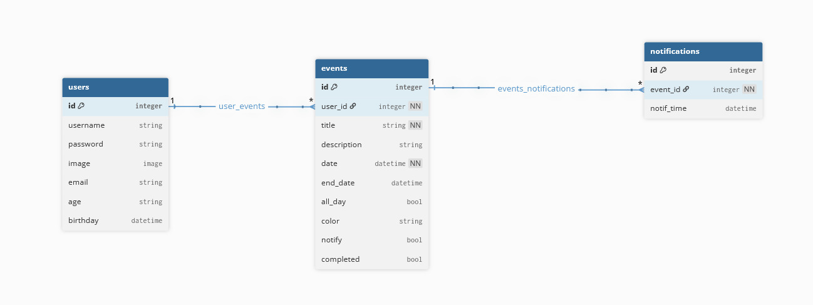

## Diseño Web :computer:

<!-- Documento de diseño web -->
### :art: Documento de diseño
#### Principales

#### Secundarios

#### Neutros
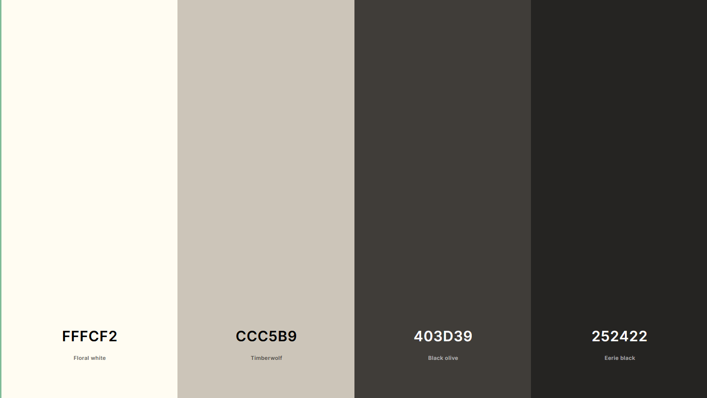
#### Alertas

<!-- Vistas principales -->
### :mag: Vistas principales
#### Landing Page
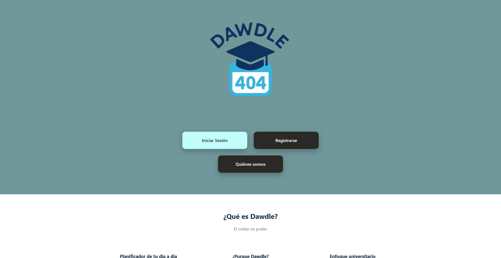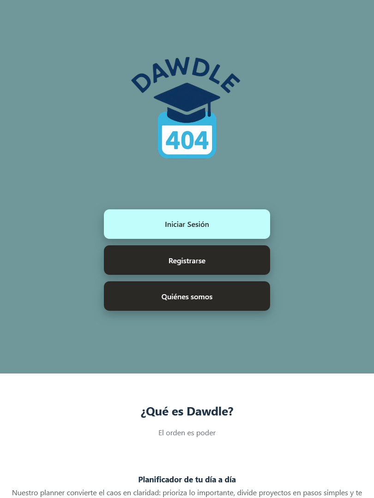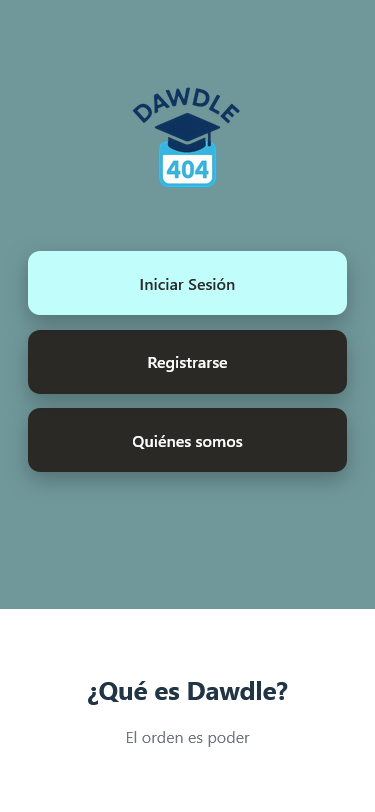

#### About Us Page
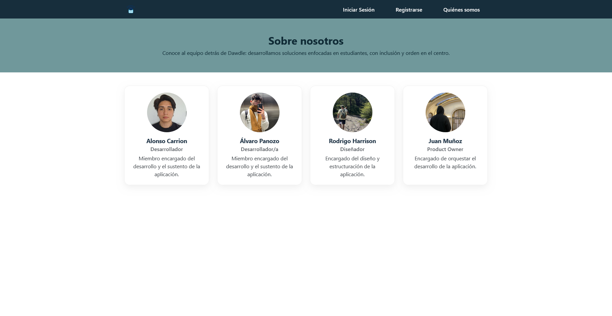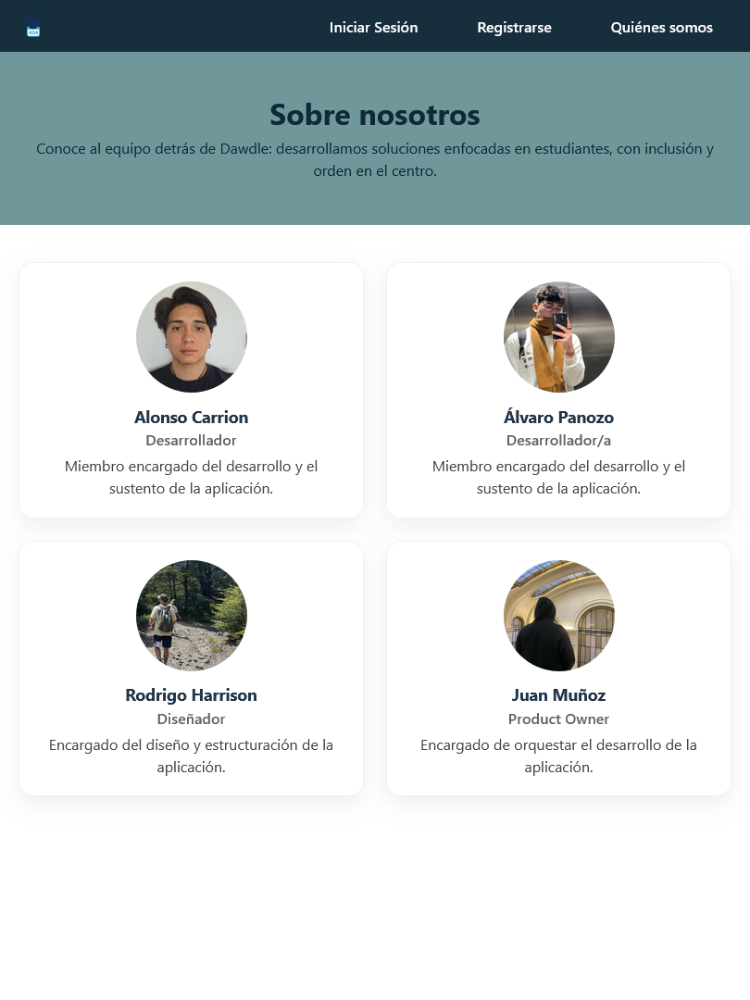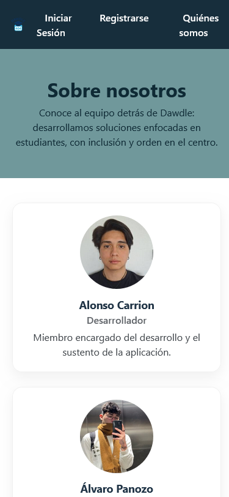

#### Login Page
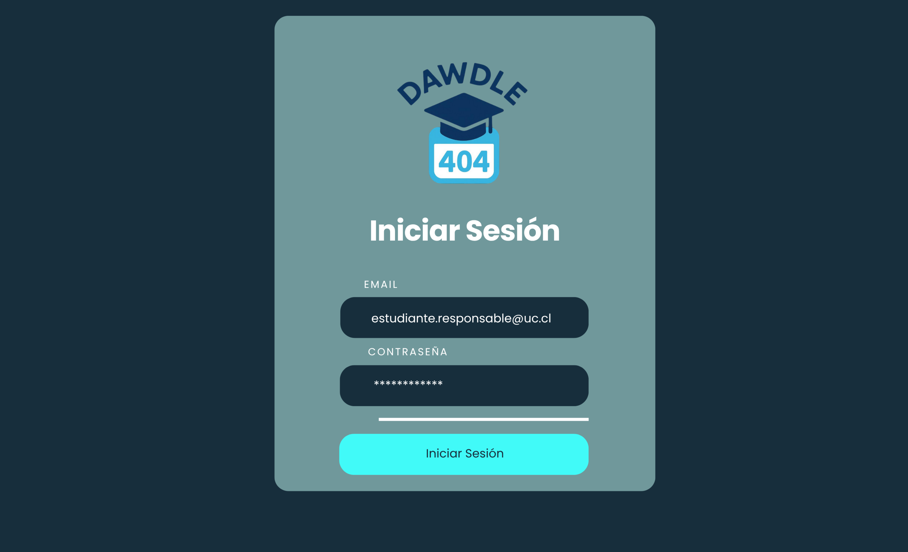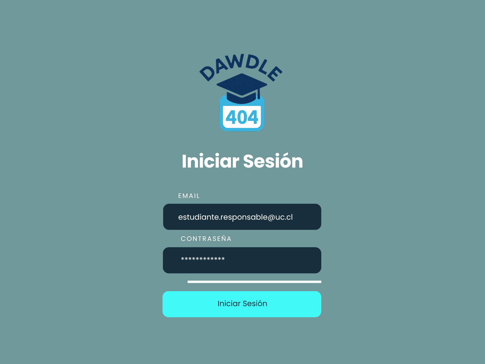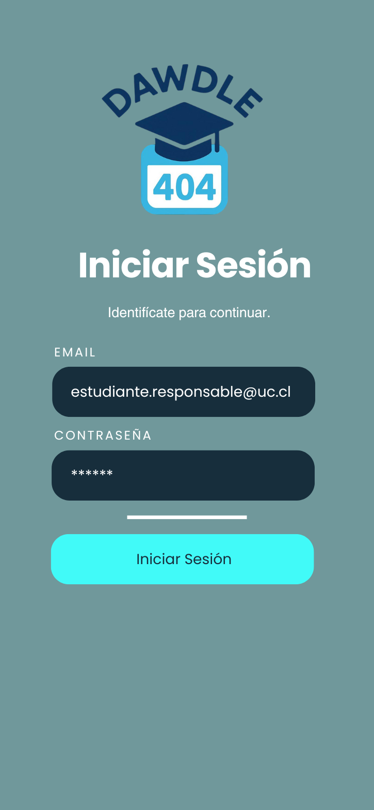

<!-- Logo -->
### :art: Logo
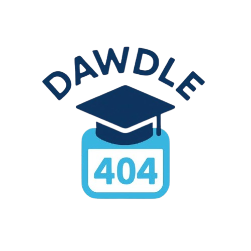

<!-- ejemplo de aplicacion -->
### :iphone: Ejemplo de aplicación
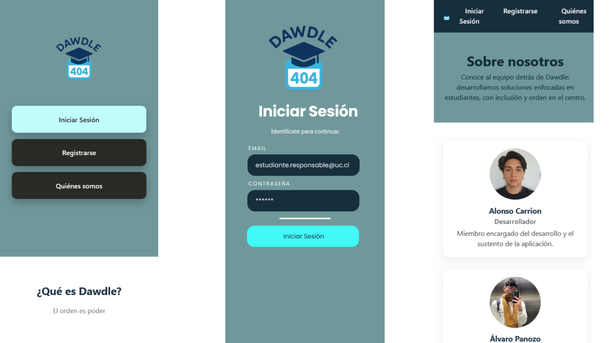