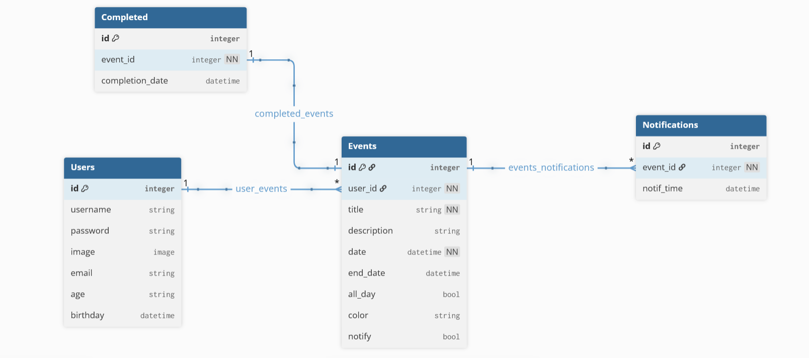
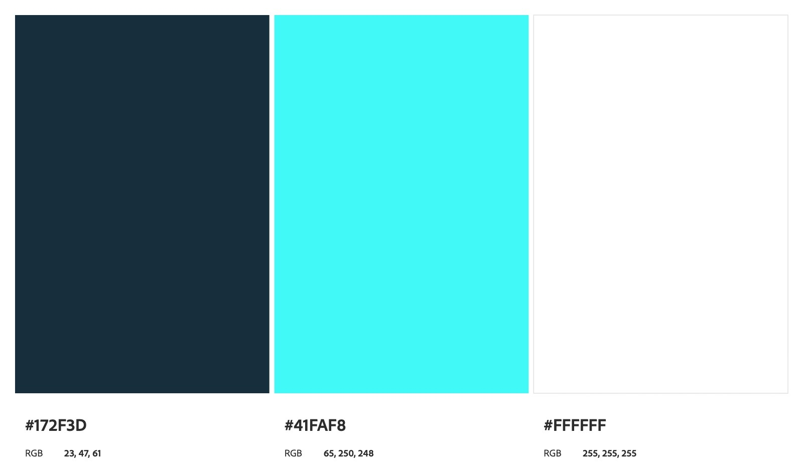
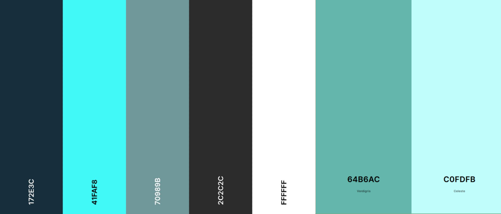
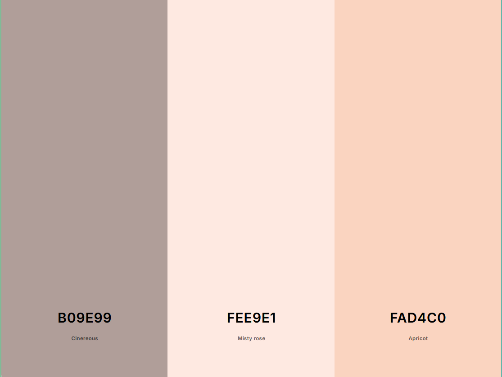
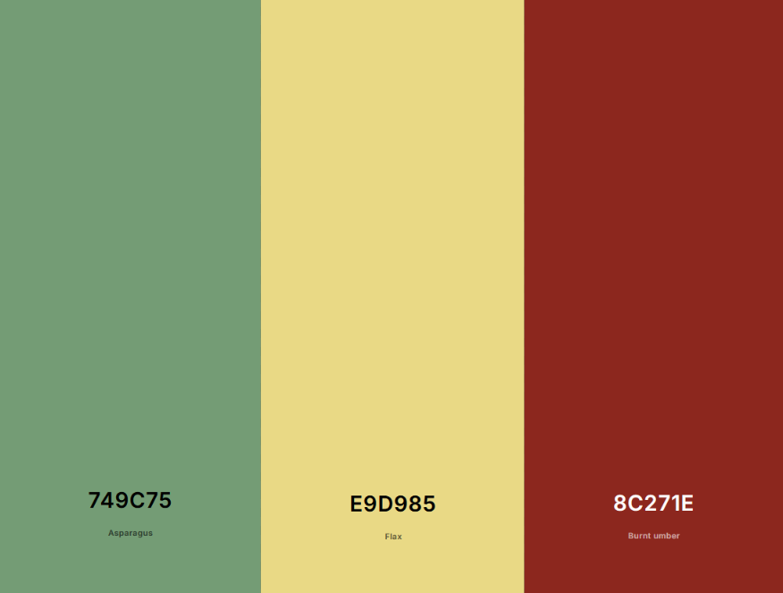
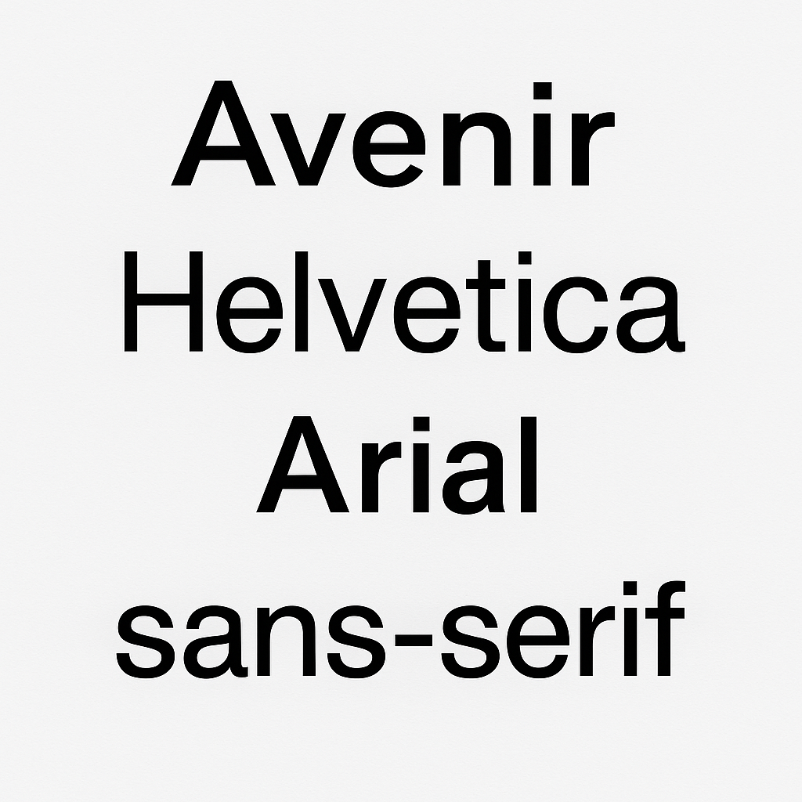

# E1 :construction:

* :pencil2: **Nombre Grupo:** Los 404

## Link aplicación
https://dawdle-404.onrender.com

## Descripción general :thought_balloon:

- ¿De qué se tratará el proyecto?
Dawdle 404 será una aplicación web diseñada para ayudar a estudiantes universitarios a planificar, organizar y priorizar sus tareas, clases, metas y eventos. Su objetivo es transformar la procrastinación en productividad mediante un entorno visual limpio e intuitivo que permita gestionar el tiempo de manera efectiva, con recordatorios, metas y seguimiento de progreso.

- ¿Cuál es el fin o la utilidad del proyecto?
El fin del proyecto es ofrecer una herramienta digital que optimice la gestión del tiempo y reduzca el estrés académico. Dawdle 404 busca convertir la desorganización y postergación en hábitos productivos, ayudando a los usuarios a mantener el control de sus actividades, mejorar su rendimiento y equilibrar su vida académica y personal.

- ¿Quiénes son los usuarios objetivo de su aplicación?
Los usuarios objetivo son principalmente estudiantes universitarios que buscan mejorar su organización, cumplir plazos y gestionar múltiples responsabilidades académicas. También puede ser útil para profesores, ayudantes o tutores que deseen planificar clases, actividades o tareas grupales dentro de la misma plataforma.

## Consideraciones generales
Dado que esta entrega solo considera front-end, no existe un back-end que valide las sesiones de usuarios. Con el fin de poder visualizar las vistas deseadas, se ha "hard codeado" de manera que el unico login valido es el de admin@dawdle.com con contraseña 123456, con cualquier otra combinación de email y contraseña se logrará un error de validación. Analogamente, al momento de registrarse el mensaje de error ocurre cuando se introducen contraseñas diferentes, en caso de cumplir con los requisitos, mostrará un mensaje de confirmación de registro, pero obviamente no se registrará en la base de datos (ya que aun no existe). De igual manera al crear eventos, se mostrará un mensaje de confirmación de creación, pero no se creará obviamente, ya que no existe un back-end. *(todo esto es con el objetivo de que se puedan visualizar las vistas deseadas)*

## Historia de Usuarios :busts_in_silhouette:

1. Como usuario quiero registrarme con mi correo electrónico para empezar a planificar mis eventos y tareas.  
2. Como usuario quiero iniciar sesión de forma segura para acceder a mis eventos personales.  
3. Como usuario quiero agregar un evento con título, descripción y fecha para organizar mis tareas y compromisos.  
4. Como usuario quiero editar la información de un evento existente para actualizar detalles cuando haya cambios.  
5. Como usuario quiero eliminar un evento que ya no necesito para mantener mi calendario limpio y ordenado.  
6. Como usuario quiero marcar un evento como todo el día para resaltar actividades importantes que ocupan toda la jornada.  
7. Como usuario quiero asignar un color a cada evento para identificar visualmente el tipo de actividad.  
8. Como usuario quiero recibir una notificación antes de que comience un evento para prepararme con anticipación.  
9. Como usuario quiero definir la hora exacta de mis notificaciones para ajustarlas según mi rutina diaria.  
10. Como usuario quiero ver todos mis eventos en un calendario semanal o mensual para obtener una visión general de mi tiempo.  
11. Como usuario quiero ver el detalle de cada evento al hacer clic sobre él para recordar la información específica sin buscarla manualmente.  
12. Como usuario quiero subir o cambiar mi imagen de perfil para personalizar mi cuenta.  
13. Como usuario quiero recibir recordatorios automáticos de los eventos que marqué con notificación para evitar olvidos importantes.  
14. Como usuario quiero agregar mi fecha de nacimiento al perfil para recibir mensajes personalizados de la aplicación.  
15. Como usuario quiero ver un resumen de mis eventos completados y pendientes para evaluar mi organización semanal.  
16. Como usuario quiero sincronizar mis eventos entre distintos dispositivos para mantener mi planificación actualizada en todo momento.

## Diagrama Entidad-Relación :scroll: (Corregido)
<!-- Insertamos la imagen ER-Model.png -->

## Diseño Web :computer:

<!-- Documento de diseño web -->
### :art: Documento de diseño

#### Logo (Nuevo)

#### Principales

#### Secundarios

#### Neutros

#### Alertas

### :art: Tipografía (Nuevo)

#### Fuentes
Además de las tipografías utilizadas, se considera las tipografías propias de cada sistema operativo que funcionan por defecto cuando no las declarados explícitamente en el código de las vistas (system-ui).

<!-- Mockups -->
### :mag: Mockups
#### Mock up de Landing Page

#### Mockup de About Us Page

#### Mockup de Login Page

#### Mockup de Main Page (Nuevo)

<!-- Vistas -->
### :mag: Vistas Realizadas con Código (Nuevo)
#### Vista de Landing Page (Nuevo)

#### Vista de About Us Page (Nuevo)

#### Vista de Login Page (Nuevo)

#### Vista de Main Page (Nuevo)

#### Vista de Docs Page (Nuevo)

(Nuevo) Se ha incorporado además el Navbar en las vistas proporcionadas, estas permiten dirigirse a todas las vistas confeccionadas de manera que no se deba modificar manualmente el URL.

<!-- Componentes dinámicos -->
### :mag: componentes (Nuevo)
Se ha creado la carpeta "componentes" donde se pueden verificar los componentes dinámicos en paralelo con la visualización de estos en la página web.

<!-- Logo -->
### :art: Logo

<!-- Ejemplo de Aplicacion -->
### :iphone: Ejemplo de aplicación (Corregido)

